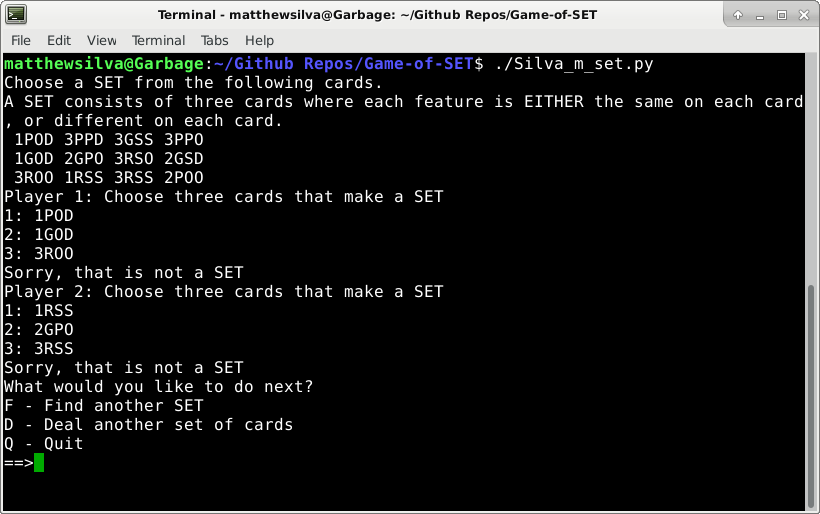
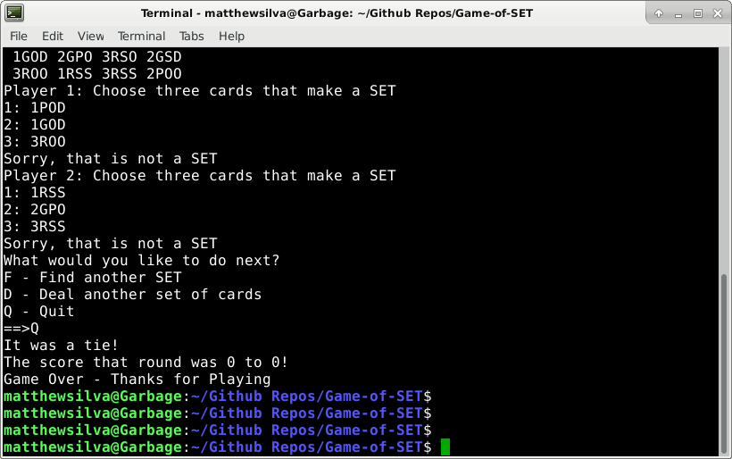

# Game-of-SET

TESTED ON DEBIAN STRETCH

Installation:

	Install Python 3:

	sudo apt-get install python3
	
	
Running Code:
	
	python3 Silva_m_set.py
	
	
	OR
	
	
	./Silva_m_set.py
	
	
	OR
	
	
	python3
	
	(entered shell)
	>>> import Silva_m_set
	
	>>> Silva_m_set.main()
	
	
	OR
	
	
	python3 -c 'from Silva_m_set import *;  main()'
	
Design:

	See the design documentation in "Matthew Silva CSC 110 - SET Programming Project Design.py"

	